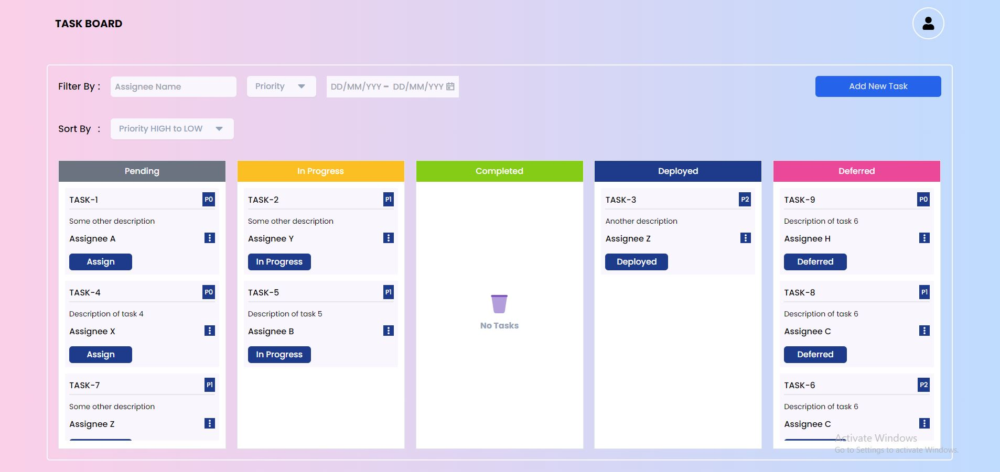
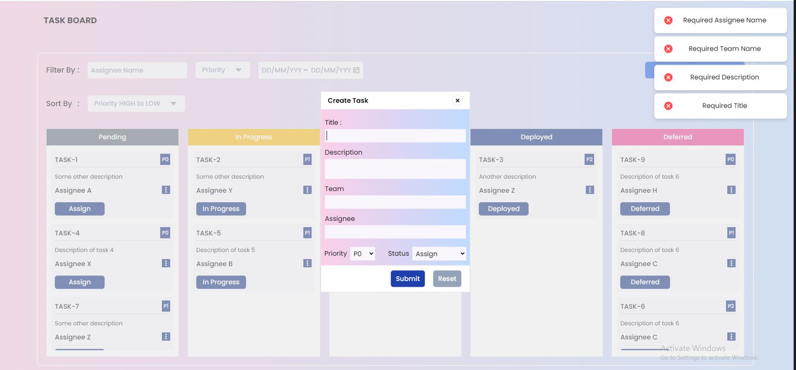
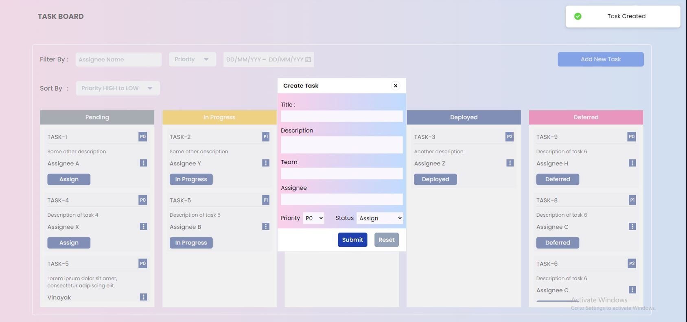
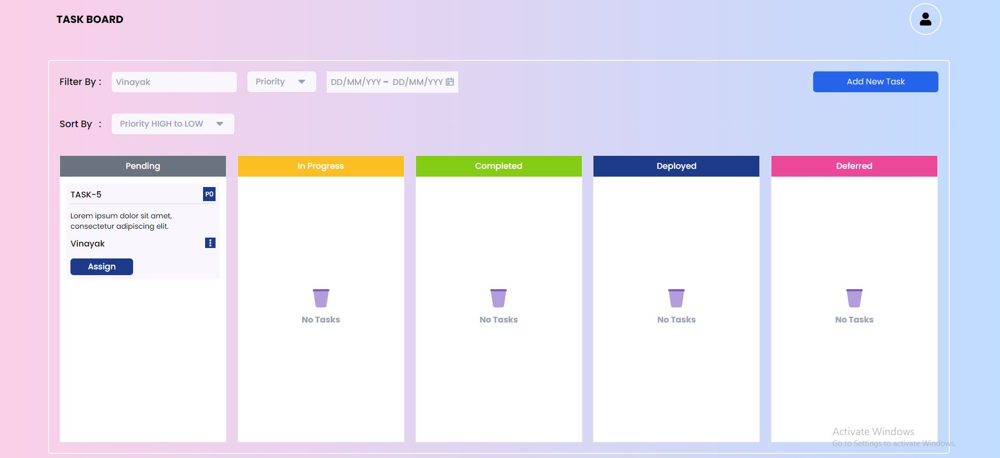
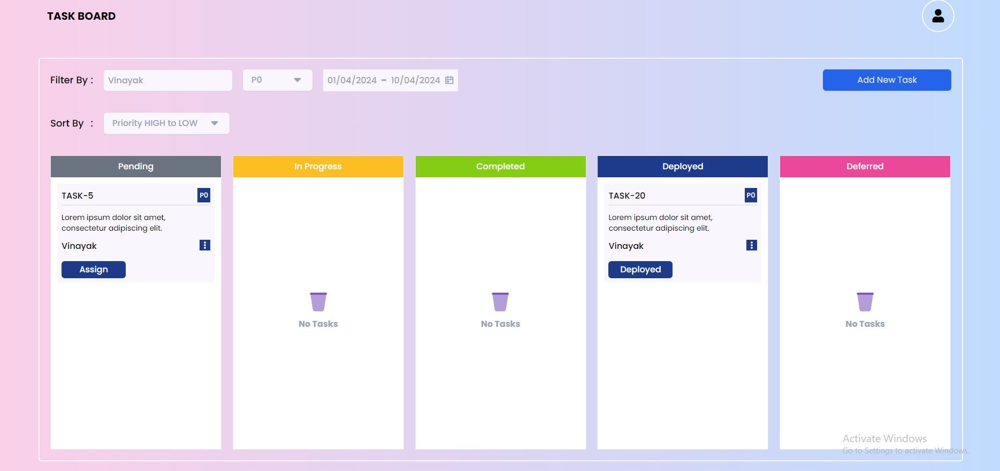
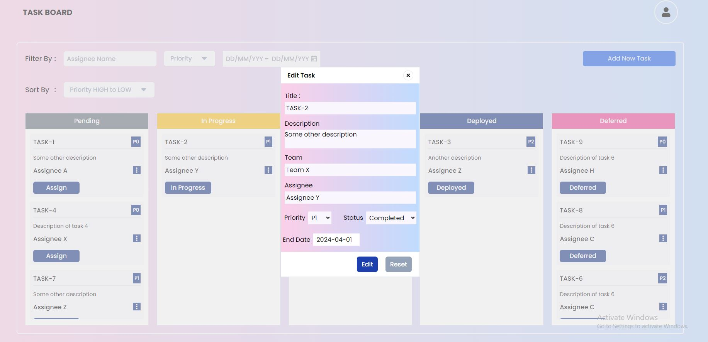
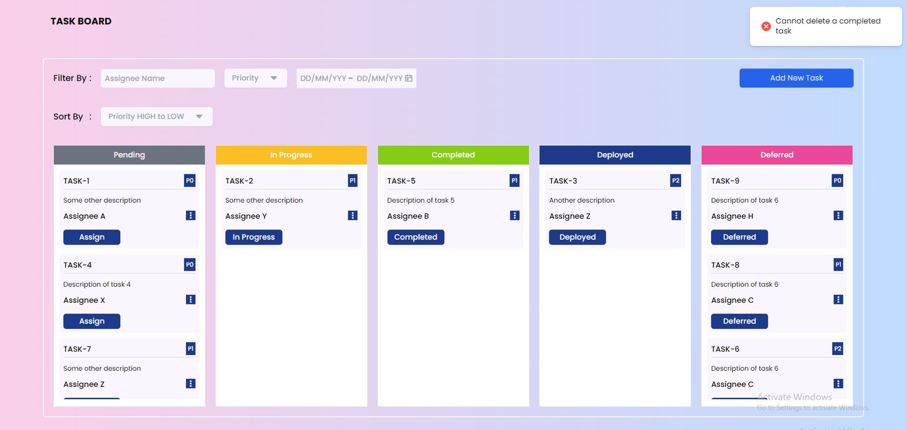

# Task Tracker Web App [Fully Responsive]

This project is a Task Tracker web application built for managing tasks within a team in an organization. It allows users to create tasks with various properties such as title, description, start date, end date (if completed), status, assignee, and priority. The app provides functionality to sort and filter tasks based on different criteria like priority, start/end date, assignee, and more.

## Tech Stack

- **React.js + Vite**: Frontend framework for building user interfaces.
- **Redux**: State management library for managing application state.
- **Tailwind CSS**: Utility-first CSS framework for styling.
- **React Hook Form**: Library for managing form state and validation.
- **React Hot Toastify**: Toast notifications for displaying error or success messages.
- **React Icons**: Icon library for adding icons to the UI.
- **React DatePicker**: It offers features such as date selection, range selection, time selection, and customization options for appearance and behavior.


## Features

- Create tasks with properties:
  - Title
  - Description
  - Start Date (auto-generated on task creation)
  - End Date (only for completed tasks)
  - Status (Pending, In Progress, Completed, Deployed, Deferred)
  - Assignee (task owner)
  - Priority (P0 / P1 / P2)
- Add/delete tasks (completed tasks cannot be deleted).
- Edit task status/priority (cannot edit assignee name, description, team, or title).
- Sort tasks by priority and start/end date.
- Filter tasks based on:
  - Date range (task created date from and to range)
  - Assignee
  - Priority
- Ability to apply multiple filters in combination.
- Reusable components:
  - Edit/Create Task form
  - Priority and Sort By components
  - Task Cards
  - Status Card
- Easy state management using Redux.
- Error handling while editing or creating a task.

## Best Practices

1. **Reusable Components**:
   - The project utilizes reusable components for various functionalities such as:
     - `Edit/Create Task form`: This component is used for both editing and creating tasks, promoting code reuse.
     - `Priority and Sort By components`: Both functionalities use the same component, reducing redundancy.
     - `Task Cards`: These are reusable components used to display individual task details.
     - `Status Card`: Another reusable component used to display task status.
2. **Easy State Management using Redux**:
   - Redux is employed for managing application state, providing a centralized store for storing and updating data.
3. **Error Handling**:
   - The application implements error handling mechanisms to handle errors encountered during task editing or creation, ensuring a smooth user experience.


## Installation

To get started with this project, follow these steps:

```bash
# Clone the repository to your local machine
gh repo clone VINAYAK9669/Internship-Task

# Navigate to the project directory
cd your-project

# Install dependencies using npm
npm install

# Start the development server
npm run dev
```

## Screenshots

### On Initial Loading : Data are provided to check the website quickly.


### Create Task [ERROR HANDLING]: While Creating the task if form submitted without filling the required Data


### Success MESSAGES: Once the task submitted app will show the success message


### Filter:  Assignee, Priority, Date Range



### Edit Task: (If the status changes to "completed" then automatically the END DATE filed will appear.


### Delete Task: The tasks from completed column can't be deleted.


